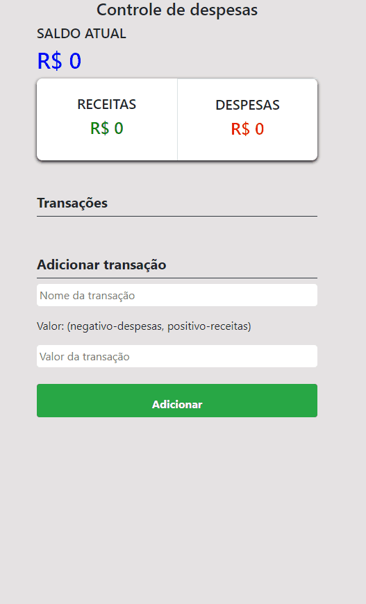

## Controle de Despesas

<h1 align="center">
  
</h1>

Este é um projeto de Controle de Despesas desenvolvido usando as seguintes tecnologias:

- [Vue.js](https://br.vuejs.org/)
- [HTML](https://developer.mozilla.org/pt-BR/docs/Web/HTML)
- [Bootstrap 4.6](https://getbootstrap.com/docs/4.6/getting-started/introduction/)

### Executando o Projeto

Para executar o projeto, siga os passos abaixo:

1. Clone o repositório para a sua máquina local.

   ```bash
   git clone https://github.com/seu-usuario/seu-fork.git
   ```

2. Navegue até a pasta do projeto.

   ```bash
   cd controle-de-despesas
   ```

3. Instale as dependências do projeto.

   ```bash
   npm install
   ```

4. Inicie o servidor.

   ```bash
   npm run serve
   ```

5. Agora você pode acessar o projeto em [`localhost:8080`](http://localhost:8080) no seu navegador.

### Funcionalidades

Este projeto de Controle de Despesas permite que você registre suas transações financeiras, separando receitas de despesas. Você pode adicionar transações com um nome e um valor. As transações positivas são consideradas receitas, enquanto as negativas são despesas. O saldo atual é exibido, mostrando a diferença entre receitas e despesas. Você pode adicionar e excluir transações conforme necessário.

### Como Usar

1. No campo "Nome da Transação", digite um nome descritivo para a sua transação.

2. No campo "Valor da Transação", digite o valor correspondente à sua transação. Use valores positivos para receitas e valores negativos para despesas.

3. Clique no botão "Adicionar" para registrar a transação.

4. Suas transações serão exibidas na seção "Transações", separadas em "Receitas" e "Despesas". Você pode excluir uma transação clicando no botão "x" ao lado dela.

5. O saldo atual é exibido na parte superior da página, mostrando a diferença entre receitas e despesas.

Lembre-se de que este é um projeto de exemplo e pode ser personalizado de acordo com as suas necessidades. Aproveite o controle de despesas!
